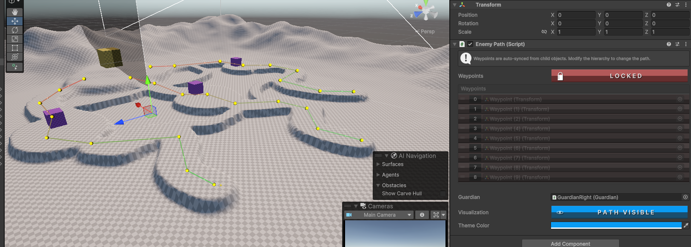
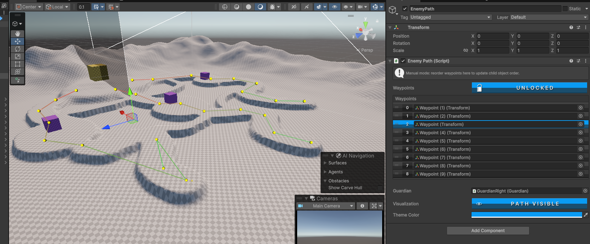
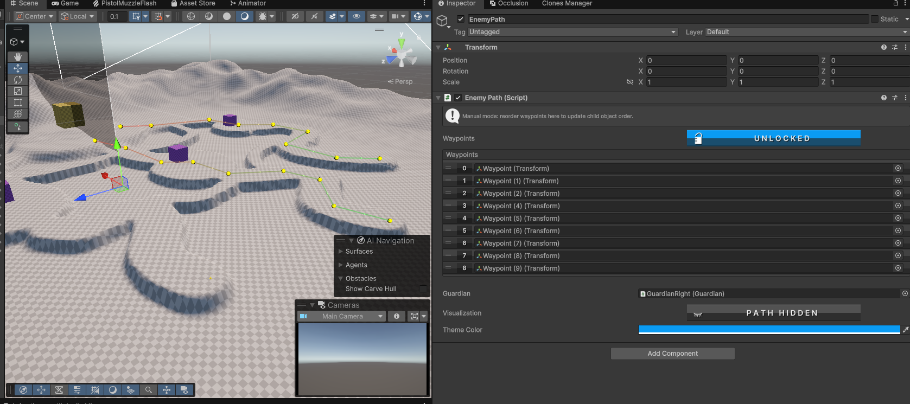
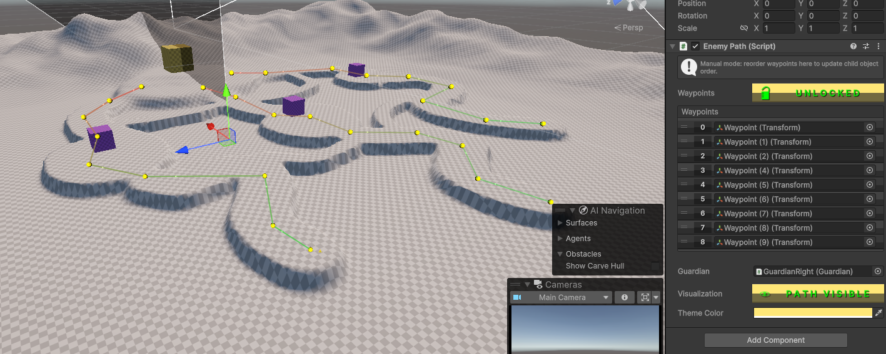
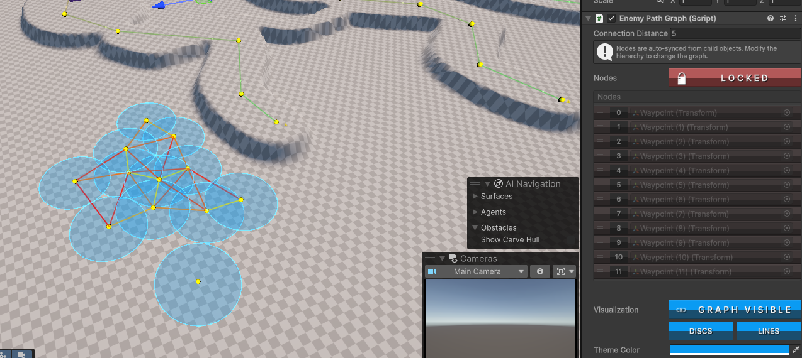
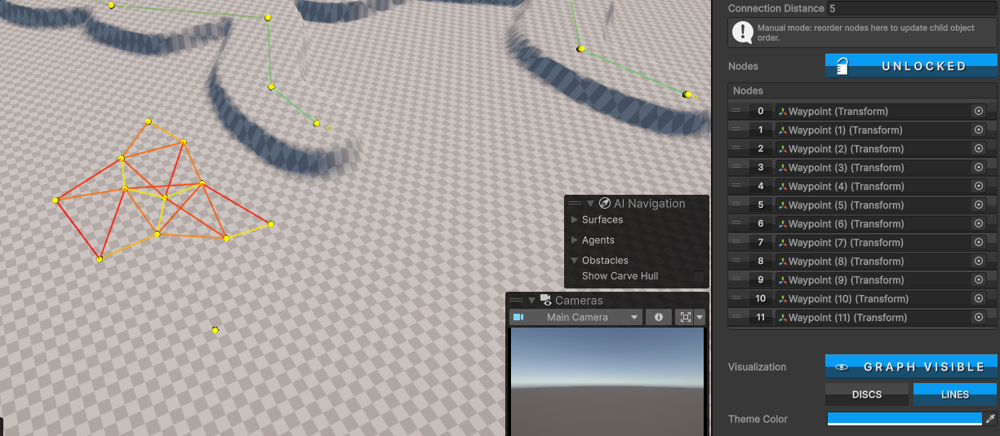
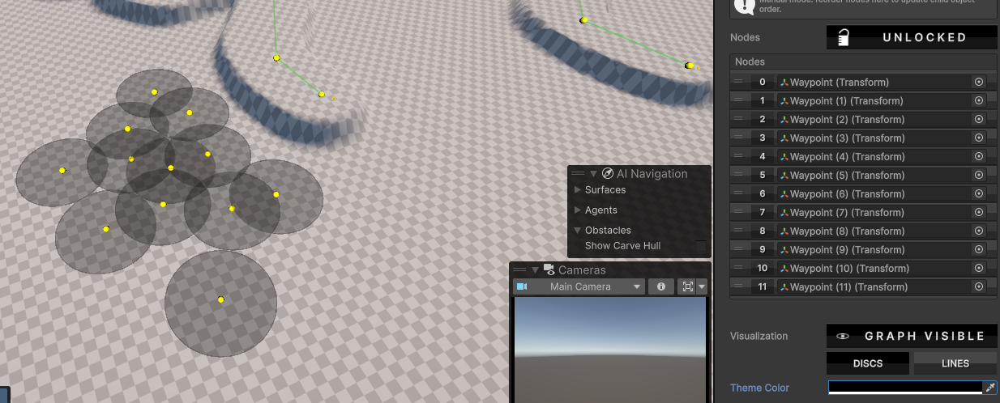

EnemyPaths contains two basic enemypath core logic others can use and expand their own codebase.

`EnemyLinearPath` is mostly meant for TowerDefense games in mind where enemies strictly or loosely but follow one string of `waypoints` / `ainodes`.
EnemyGraphPath is for more games where enemies would free roam. Keep in mind using this does not mean you will have a performative game, this is a core build you'll need to make sure your enemies are using them cautiously. AI nodes can "confuse" enemies and can be performance heavy if done poorly. These are very basic tools in a fancy clothing, you'll need to expand on it and / or make your enemyAI logic smooth.

Why are these tools here to begin with?
- Unity's visual representation of certain features are lackluster to say the least so having more control over what and when to see is really handy
- EditorScripts make sure you can prefab your `waypoints` / `ainodes` and just drag and drop them in the scene, once you are done you can grab them all and place them under a parent object which has one of these scripts on them. The reason why making prefabs out of these `waypoints` is important is because you will not need to worry about placing them manually and then moving them up and down, they stick to surface so you will never need to worry about moving gameobjects - meaning enemy ai will not have issues trying to reach these places
- Automatic referencing alone is already enough convinience, but we also got some foolproofing where you won't be able to accidently mess up their list while working - but if you need to change their order or something you can either just move the childobjects OR move them in the list and they'll move these childobjects making it even more fun
- Lastly, visual representation, we started with this but we've got some nice buttons to look at, better list (since we dont need + or - on them, they are gone), the ability to hide certain features, the ability to see them even when they are not selected (Linear is also animated how neat is that?), these buttons scale with the inspector (text doesn't yet, will fix later), and finally the ability to give them the color YOU want!

Here are some pictures:










Some tips:

To expand on these editorscripts, you'll need to work on the Editor too. For example I have my `Guardian`s that I need to reference in my `EnemyLinearPath`:
```cs
        [SerializeField] private Guardian guardian;
        public Guardian Guardian => guardian;
```

And for then I need to add them in `OnInspectorGUI()` in `EnemyLinearPathEditor` like so:

```cs
            SerializedProperty guardianProp = serializedObject.FindProperty("guardian");
            EditorGUILayout.PropertyField(guardianProp);
```